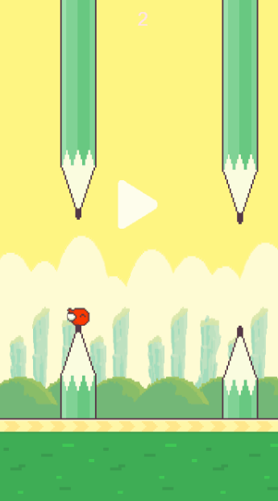

### Flappy-Bird-JavaScript

------

 

##### Intro

An  little flappy bird :bird: game written by JavaScript

##### 

##### Preview

More details, please click 👉  [here](https://syizhang.com/Front-end/Game) for online preview.

For best experiences, please turn on **mobile mode** in Chrome development tools (F12) with iPhone 6/7

#####

##### Libraries and tools used in the project

- [x] ES6

- [x] Design-Pattern

##### 

##### Structure

- Game
  - entry file
- Main
  - initialize canvas and global objects
  - initialize sprites and bind click events
- Director
  - take hand of the logic part of the game
  - manage the creation or destroy
- Resources
  - Manage all the image resources
- Resource Loader
  - Loader resources
- Sprites
  - Background.js / Land.js 
  - Score / StartButton
  -  UpPencil / DownPencil
  - Bird 

